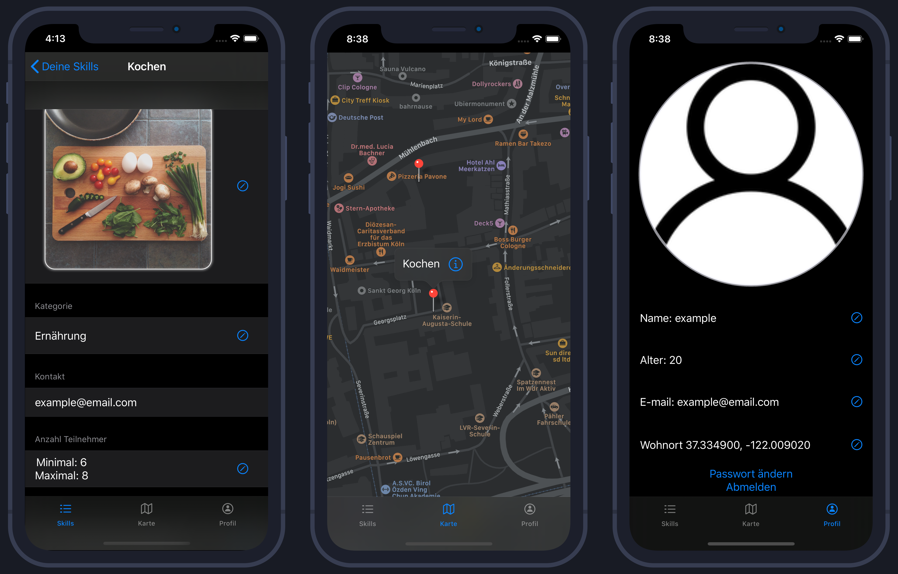
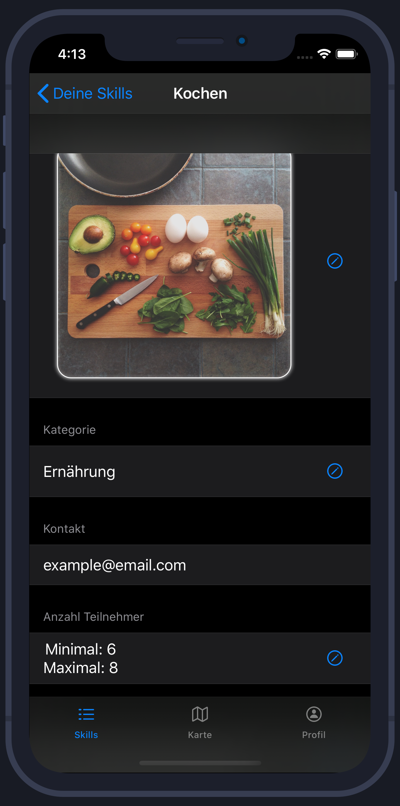

# Kas4Elderly

## Grundidee
Da für uns und das Altenheim die Erfahrung die wir in der Zusammenarbeit gemacht haben so positiv war haben wir diese App entwickelt um diese Erfahrung auch für anderre Schulen und Altenheime möglich zu machen. Die Idee ist also dass Schüler und alte Leute die Lust haben miteinander zusammenzuarbeiten über diese App zueinander finden.
Kas4Elderly ist also eine Plattform die die Zusammenarbeit von alten und jungen Menschen fördern soll.

## Funktionsweise
Sowohl junge als auch alte Leute können Skills einstellen. Dies kann ales mögliche von Kochen über Technik zu Fitness umfassen. 

Anderre Leute können dann über die karte nach angebotenen Skills in ihrer nähe schauen und bei Interesse die Veranstalter per E-mail kontaktieren. 

